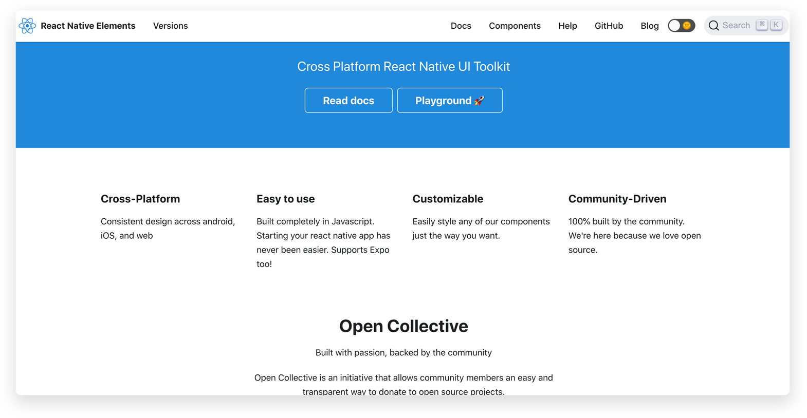
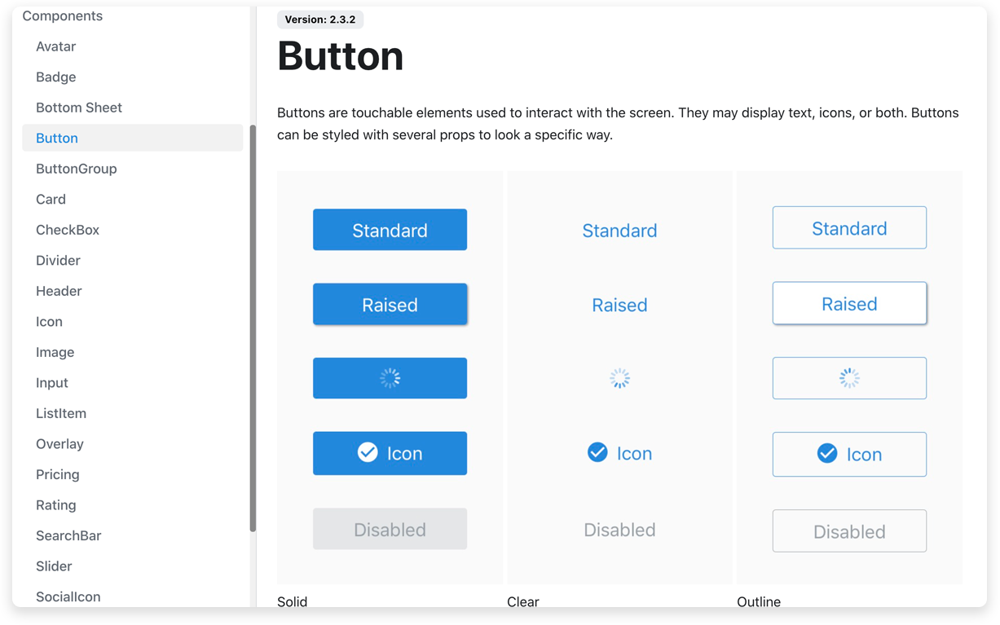
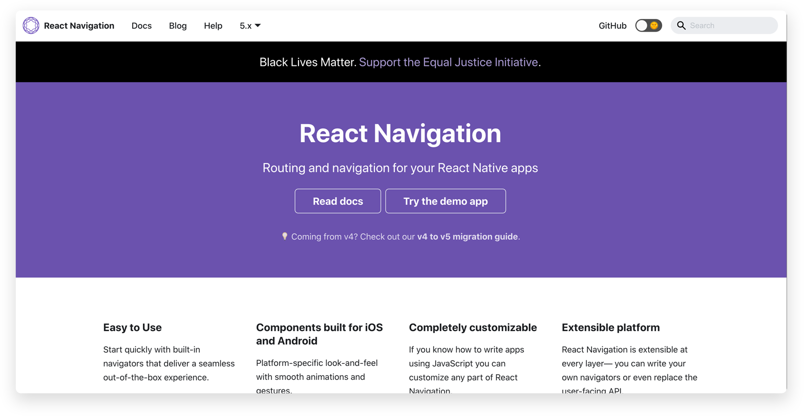
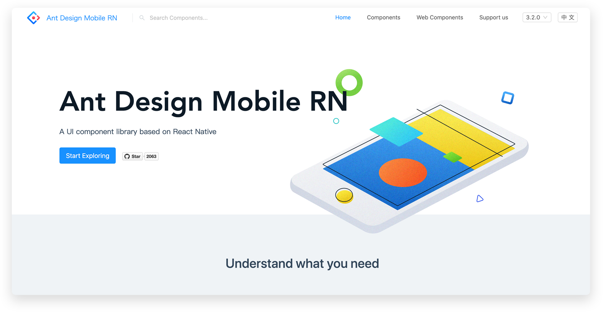
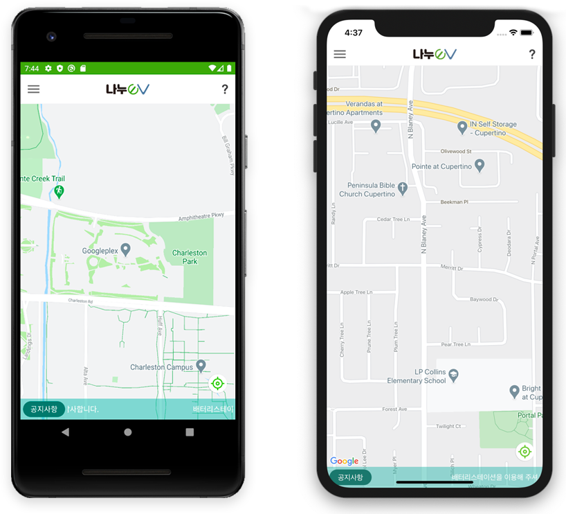

# React Native로 앱 개발하면서 유용하게 사용한 Component Library

배터리 대여 시스템 [나누](http://aimskorea.kr/batterystation.html)의 사용자 애플리케이션을 개발하면서 처음으로 React Native(이하 RN)를 사용해 보았습니다. 한차례 앞서 겪은 ReactJS와 생각보다 많은 부분에서 차이가 있어서 어려운 부분들도 있었지만, 많은 오픈 소스 커뮤니티에 배포되어 Component Library를 적절하게 이용할 수 있었기 때문에 앱 배포까지 완료할 수 있었던 것 같습니다. 그래서 이번 글에서는 앱 개발 과정에서 유용하게 사용한 Component Library들을 소개해 보려고 합니다.

***

## React Native Component Libraries

### 1. react-native-elements
* https://reactnativeelements.com/

<p align="center"></p>

React Native Elements는 개발자가 만든 여러 훌륭한 오픈 소스 UI 구성 요소를 한곳에 모아 놓은 cross-platform UI toolkit입니다. 웹 개발 프레임워크 중 하나인 Bootstrap과 유사하여 사용자 정의 할 수 있을 만큼 광범위하고 사용 가능한 스타일을 제공합니다.

React Native Elements 패키지에는 Avatar, Badge, Button, Header, Icon, Input, SocialIcon과 같은 다양한 컴포넌트들이 기본적이고 제한된 React Native 구성 요소를 대체하기 위해 미리 빌드된 구성요소가 스타일링 되어 있습니다. 자바 스크립트로 제작되어 구성 요소를 쉽게 업데이트하거나 수정할 수 있습니다.

```javascript
import { Button, ThemeProvider } from 'react-native-elements';

const MyApp = () => {
  return (
    <ThemeProvider>
      <Button title="Hey!" />
    </ThemeProvider>
  );
};

//출처: https://reactnativeelements.com/ 
```

<p align="center"></p>

[이미지출처] : <a href="https://reactnavigation.org/">React Native Elements 공식 사이트<a>


### 2. React Navigation v5.0
* https://reactnavigation.org/

<p align="center"></p>

React Navigation은 몇 가지 핵심 유틸리티로 구성되며 Navigator가 앱에서 탐색구조를 만드는 데 사용됩니다. 모바일은 웹과 달리 대부분이 단일 화면으로 구성되기 때문에, RN에서는 화면전환을 위해 React Navigation 라이브러리를 사용하면 매우 유용합니다. React Navigation을 통해 개발자는 내비게이션과 히스토리를 간단하게 관리할 수 있기 때문입니다.

단, react-navigation v4.0부터는 필요한 Navigation을 사용하기 위해서는 추가적인 Navigation 라이브러리를 설치해야 합니다.

#### createStackNavigator

네비게이터는  `Stack Navigator`  `Tab Navigator` `Drawer Navigator` 로 3가지 탐색 방식으로 개발할 수 있고, `Stack Navigator`가 가장 일반적인 네이게이터로 저 또한 앱 개발 시 사용하였습니다. 기본적인 코드 샘플은 아래와 같습니다.

```javascript
import { createStackNavigator } from '@react-navigation/stack';

const Stack = createStackNavigator();

function MyStack() {
  return (
    <Stack.Navigator initialRouteName="Home">
      <Stack.Screen name="Home" component={Home} />
      <Stack.Screen name="Notifications" component={Notifications} />
      <Stack.Screen name="Profile" component={Profile} />
      <Stack.Screen name="Settings" component={Settings} />
    </Stack.Navigator>
  );
}

//출처: https://reactnavigation.org/ 
```

createStackNavigator는 페이지를 Stack에 쌓아두어 이동하는 방법입니다. 이것은 이전의 페이지를 그대로 유지할 수 있는 장점이 있지만, 페이지를 이동할때 reloading을 시키지는 못합니다. initialRouteName를 통해 처음 로드 시 초기 경로를 정의할 수 있고, 원한다면 화면 이동 시 파라미터를 함께 넘겨줄 수도 있습니다.

<div data-snack-id="SWXEXBnce" data-snack-platform="web" data-snack-preview="true" data-snack-theme="light" style="overflow:hidden;background:#F9F9F9;border:1px solid var(--color-border);border-radius:4px;height:505px;width:100%"></div>
<script async src="https://snack.expo.io/embed.js"></script>

[출처] : <a href="https://reactnavigation.org/docs/navigating/">React Navigation 공식 사이트<a>


### 3. Ant Design & Ant Design Mobile
* https://rn.mobile.ant.design/

<p align="center"></p>

Antd는 Ant Financial이 제공하는 React UI Component Library 중 하나로 약 50개 이상의 component를 제공합니다. Ant Financial은 알리바바 그룹의 자회사로 핀테크 기술을 개발하는 곳입니다. 그래서 antd의 기본 언어는 중국어입니다. 공식 문서는 영어를 함께 지원하지만 github issue에서는 중국어가 자주 등장하여 어려움이 있습니다.

그럼에도 개발자들의 전폭적인 지지를 받는 이유는 바로 컴포넌트의 접근성이 매우 높기 때문입니다. 기본적인 form, button, table뿐만 아니라 transfer, rate, cascader, skeleton 등 다른 라이브러리에서 쉽게 볼 수 없는 컴포넌트들을 제공합니다. 하나의 컴포넌트마다 이를 변형하는 다양한 예제를 제공하기 때문에 UX 적으로도 유용합니다.

또한 레이아웃을 제공하기 때문에 디자인이 없더라도 손쉽게 개발을 시작할 수 있고 자세한 API가 제공되기 때문에 퍼블리셔나 초보자들도 쉽고 빠르게 사용할 수 있습니다.

### 4. react-native-maps
* https://github.com/react-native-maps/react-native-maps

React Native 커뮤니케이션에서 제공하는 라이브러리입니다. 에임스는 배터리 대여 시스템 및 공유 모빌리티 솔루션을 개발하는 회사인 만큼 지도기능은 필수적입니다. 마찬가지로 나누 사용자 애플리케이션에서도 지도 기능이 필수적으로 들어가야 했기 때문에 `react-native-maps`을 사용하여 지도 화면 부분을 구현하였습니다.

단, 구글맵을 사용하기 위해서는 provideAPIKey가 필수적으로 필요하고 크로스 플랫폼인 만큼 android와 ios에 각기 다른 추가적인 설정과 설치가 필요합니다. 실제 라이브러리를 통해 개발된 화면입니다.
<p align="center"></p>


### 5. react-native-linear-gradient
* https://github.com/react-native-linear-gradient/react-native-linear-gradient

expo 환경에서는 gradient가 기본적으로 지원되지만, RN에서는 아직 공식적으로 지원하고 있지 않기 때문에 react-native-linear-gradient 라이브러리를 통해서 사용할 수 있습니다. 간단하게 설치 후에 적용하는 코드와 결과 화면은 다음과 같습니다.

```javascript
    import LinearGradient from 'react-native-linear-gradient';

    // Within your render function
    <LinearGradient colors={['#4c669f', '#3b5998', '#192f6a']} style={styles.linearGradient}>
    <Text style={styles.buttonText}>
        Sign in with Facebook
    </Text>
    </LinearGradient>
});

//출처: https://github.com/react-native-linear-gradient/react-native-linear-gradient
```

<p align="center"></p>


---

## Conclusion

RN으로 개발을 하면서 유용하게 사용했고, 앞으로도 사용하게 될 Component Library 5가지를 소개해 보았습니다. 이 외에도 RN은 계속해서 다양한 라이브러리들을 제공하고 있습니다. 좀 더 다양한 라이브러리 경험을 통해 RN 개발자로서 한 단계 더 나아가기 위해 흐름에 따른 지속적인 공부와 개발을 통해 다음 업데이트될 나누 앱에 다양한 기능을 추가해 보고자 합니다.